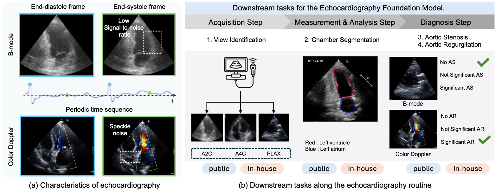
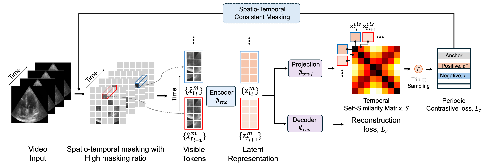
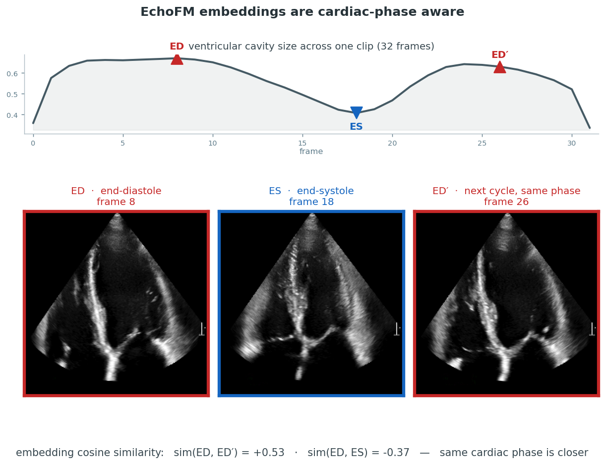

# EchoFM: A Video Vision Foundation Model for Echocardiography

[](https://ieeexplore.ieee.org/document/11040094)
[](https://huggingface.co/sekeun/EchoFM)
[](#license)

Official repository for **[EchoFM: Foundation Model for Generalizable Echocardiogram Analysis](https://ieeexplore.ieee.org/document/11040094)** (IEEE Transactions on Medical Imaging, 2025).

EchoFM is a ViT-L video foundation model pretrained on echocardiogram clips with a
self-supervised objective built around the **cardiac cycle**. Periodicity is not a
side detail of echocardiography — it is the reason echo is acquired the way it is:
every view is recorded over multiple heartbeats, because any single frame is corrupted
by speckle noise, probe motion, and breathing, and clinicians read measurements
(EF, wall motion, valve function) *across* cycles at matched phases. Frames at the
same cardiac phase in different cycles are therefore natural repeated measurements of
the same anatomy. EchoFM turns this clinical redundancy into free supervision: pulling
same-phase frames together and pushing opposite-phase frames apart yields
representations that are robust to per-frame noise and explicitly encode cardiac
phase. The pretrained encoder produces video-, frame-, and token-level representations
that transfer to segmentation, classification, and disease-detection tasks.

</img>

## Highlights

- **Periodicity-aware self-supervision.** Masked reconstruction is combined with a
  periodic contrastive objective, so embeddings encode *where in the cardiac cycle*
  each frame lies — learned without ECG, ED/ES labels, or segmentation.
- **Pretrained at scale.** Self-supervised pretraining on 290K echocardiography clips.
- **Validated downstream.** Segmentation, classification, and disease detection; the
  encoder adapts efficiently to custom tasks with light heads or fine-tuning.

</img>

## How it works

EchoFM's pretraining couples masked video modeling with the physiology of the beating
heart. The objective rests on two pillars designed for echocardiography:

- **Spatio-temporally consistent masked reconstruction.** One spatial mask is shared
  across every frame of the clip (75% masking, per-patch normalized targets), so a
  masked region stays hidden for the whole video. Reconstructing it forces the encoder
  to model how cardiac motion deforms anatomy over time — copying the same patch from
  a neighboring frame is impossible by construction.
- **Periodic contrastive learning.** The cardiac cycle itself provides the supervision:
  a pixel-space cycle-similarity prior (motion component only; the static anatomy
  component is removed) identifies which frame pairs share a cardiac phase. A
  hard-mined triplet loss and a dense similarity-distillation (KL) loss imprint this
  periodic structure onto the embedding space.

The result is directly measurable: end-diastole frames from *different* cycles
(ED, ED′) embed close together, while ED vs. end-systole (ES) — half a cycle apart —
are pushed far apart:

</img>

On held-out clips, the embedding phase contrast is positive for 100% of clips, and the
embedding similarity structure matches the pixel-level cycle structure with r = 0.98.

## Installation

```bash
git clone https://github.com/SekeunKim/EchoFM.git
cd EchoFM
./environment_setup.sh EchoFM
```

## Pretrained weights & quick start

Weights are hosted on Hugging Face: [sekeun/EchoFM](https://huggingface.co/sekeun/EchoFM).

```python
import torch
from huggingface_hub import hf_hub_download
from EchoFM import models_mae

weights = hf_hub_download(repo_id="sekeun/EchoFM", filename="echofm_vitl.pth")
ckpt = torch.load(weights, map_location="cpu")
model = models_mae.mae_vit_large_patch16(**{
    k: ckpt["model_args"][k] for k in
    ["num_frames", "t_patch_size", "pred_t_dim", "sep_pos_embed", "cls_embed", "norm_pix_loss"]
})
model.load_state_dict(ckpt["model"], strict=False)
model.eval()

# imgs: [B, 3, 32, 224, 224] in [0, 1]
latent, _, _ = model.forward_encoder(imgs, mask_ratio=0.0)   # [B, 8*196, 1024] tokens
cls_stack = torch.stack(model.forward_prj(latent), dim=1)    # [B, 8, 1024] per-frame (phase) embeddings
video_emb = latent.mean(dim=1)                               # [B, 1024] video embedding
```

`notebooks/echofm_usage.ipynb` walks through feature extraction for downstream tasks,
masked reconstruction, and the periodicity verification shown above.

## Self-supervised pretraining

```bash
# folder of video files (.mp4/.avi/...)
torchrun --nproc_per_node=8 --standalone main_pretrain.py \
    --data_source mp4 --data_path /path/to/videos \
    --model mae_vit_large_patch16 \
    --num_frames 32 --t_patch_size 4 --mask_ratio 0.75 --norm_pix_loss \
    --batch_size 8 --epochs 200 --warmup_epochs 10 --blr 1e-3 \
    --output_dir ./output_dir

# folder of cached clips stored as .npy arrays of shape (T, H, W, 3) uint8
torchrun --nproc_per_node=8 --standalone main_pretrain.py \
    --data_source npy --data_path /path/to/clips [same options]
```

Total loss = masked reconstruction + `--triplet_weight` × triplet +
`--cycle_weight` × cycle-distillation; all terms are logged separately
(`recon`, `triplet`, `cycle`, `trip_act`) to stdout and tensorboard.

Unit/smoke tests: `python tests/test_echofm.py [--cuda]`.
A SLURM/apptainer launch script is provided in `cluster/pretrain_apptainer.job`.

## License

This model and associated code are released under the CC-BY-NC-ND 4.0 license and may
only be used for non-commercial, academic research purposes with proper attribution.
Any commercial use, sale, or other monetization of the EchoFM model and its
derivatives — including models trained on outputs from the EchoFM model or datasets
created from the EchoFM model — is prohibited and requires prior approval.

## Citation

If you find this repository useful, please cite our IEEE TMI paper:

```bibtex
@article{kim2025echofm,
  title={EchoFM: Foundation Model for Generalizable Echocardiogram Analysis},
  author={Kim, Sekeun and Jin, Pengfei and Song, Sifan and Chen, Cheng and Li, Yiwei and Ren, Hui and Li, Xiang and Liu, Tianming and Li, Quanzheng},
  journal={IEEE Transactions on Medical Imaging},
  volume={44},
  number={10},
  pages={4049--4062},
  year={2025},
  doi={10.1109/TMI.2025.3580713}
}
```
