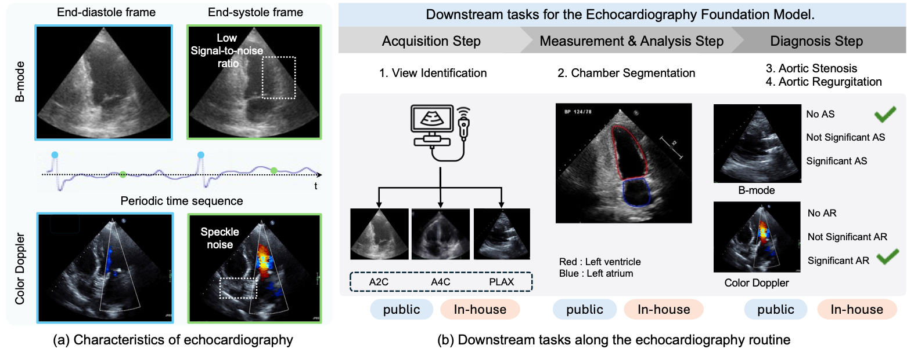
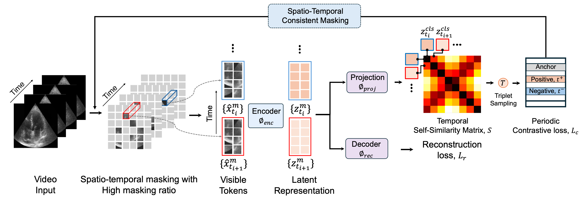

## EchoFM - A Vision Foundation Model for Echocardiogram Video

Official repo for [EchoFM: Foundation Model for Generalizable  Echocardiogram Analysis]

## Key features

- EchoFM is pre-trained on 290K Echocardiography clips with self-supervised learning
- EchoFM has been validated in multiple downstream tasks including segmentatino, classification, disease detection tasks.
- EchoFM can be efficiently adapted to customised tasks.

</img>
</img>

## 1. Environment Setup

```bash
git clone https://github.com/SekeunKim/EchoFM.git
cd EchoFM
./environment_setup.sh EchoFM
```

## 2. Download model

Download link for EchoFM Weights

## 3.Citation
If you find this repository useful, please consider citing this paper: [will be released soon]
```
@article{kim2024echofm,
  title={EchoFM: Foundation Model for Generalizable Echocardiogram Analysis},
  author={Kim, Sekeun and Jin, Pengfei and Song, Sifan and Chen, Cheng and Li, Yiwei and Ren, Hui and Li, Xiang and Liu, Tianming and Li, Quanzheng},
  journal={arXiv preprint arXiv:2410.23413},
  year={2024}
}
```
